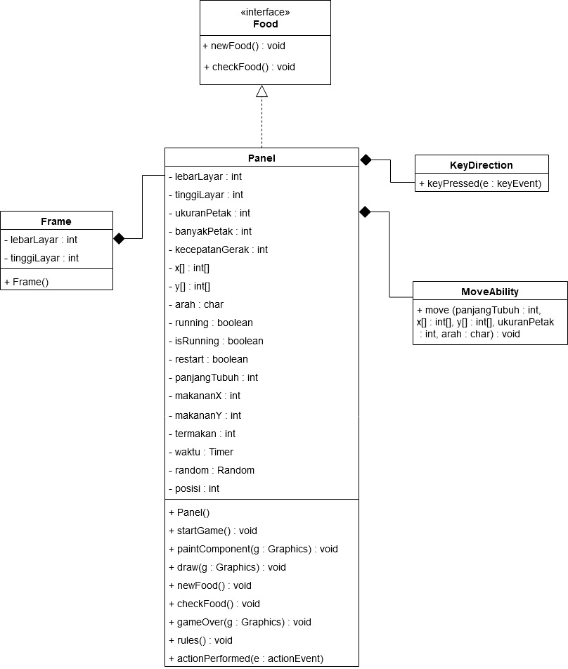

# Snake Game

This repository is a final project (Java GUI) from Object-Oriented Programming Class, Teknik Informatika Universitas Padjadjaran. 

[Challenge Guidelines](challenge-guideline.md)

**Snake Game** adalah permainan dengan objek utama adalah seekor ular dimana tugas ular tersebut adalah untuk memakan sebanyak - banyaknya buah yang ada di dalam kotak. Tantangan di dalam game ini adalah untuk tidak mengenai kotak ataupun bagian tubuh ular sendiri.

## Credits
| NPM           | Name        |
| ------------- |-------------|
| 140810190016  | Muhammad Faishal Dienul Haq    |
| 140810190020  | Join Valentino Tampubolon    |
| 140810190028  | Robby Sobari |
| 140810190044  | Ridho Emir Fajar Alam |

## Change log
- **[Sprint Planning](changelog/sprint-planning.md) - (17/11/2020)** 
   -  Discussion about the Sprint Backlog.

- **[Sprint 1](changelog/sprint-1.md) - (date from 17/11/2020 until 22/11/2020)** 
   - Create the Box
   - Testing the Box
   - Create a Snake
   - Implementation the movement of the snake
   - Test the Movement of the Snake
   - Create the Food

- **[Sprint 2](changelog/sprint-2.md) - (date from 23/11/2020 until 30/11/2020)** 
   - Make the food appear randomize
   - Test The Food 
   - Implementation of growth ability after eating the food
   - Implementation The Rules or Logic
   - Revision Position Head of the Snake in the center of Frame
   
- **[Sprint 3](changelog/sprint-3.md) - (date from 30/11/2020 until 7/12/2020)** 
   - Create a Live Score 
   - Create a Pop Up Score(Game Over)
   - Logic for Restart The Game
   - Test the Game
   - Fixed the Bug 

## Running The App
- Buka folder tempat dimana file disimpan
- Tekan pada bagian path-nya dan ganti menjadi 'cmd', maka akan muncul tampilan command promt
- Compile main program pada command prompt dengan mengetik 'javac SnakeGame.java'.
- Kemudian, run program dengan mengetik 'java SnakeGame' pada command promt
- Layar akan muncul dengan tulisan 'Game Start'
- Tekan spasi untuk memulai game dan menampilkan board serta ular.
- Setelah spasi ditekan, ular akan bergerak ke atas. untuk menggerakkan ular ke samping atau ke atas, ke bawah dapat menggunakan tombol panah arah.
- Ketika ular menyentuh sisi atau badannya sendiri, maka akan keluar tulisan 'Game Over', maka untuk mengulang tekan tombol 'R'.
- Apabila ingin mengakhiri Game dapat menekan tombol silang/close pada sisi kanan atas program.

## Classes Used

- SnakeGame sebagai main class
- Frame sebagai class untuk membuat frame/board
- Panel sebagai class untuk menampilkan objek - objek yang ada di dalam board dan prosesnya
- Food sebagai class interface yang menyimpan 2 method untuk food
- MoveAbilitiy sebagai class yang menyimpan pergerakan dari ular

## Notable Assumption and Design App Details

- Implementasi dari game terkenal yaitu Snake dimana ada seekor ular yang dapat diarahkan untuk memakan buah. Dan jika ular tersebut memakan buah, panjangnya akan bertambah.
- Panjang dan tinggi frame aplikasi berukuran 100x100 sel yang dimana satu selnya merupakan persegi dengan ukuran dibebaskan, yang penting sama setiap selnya.
- Buah berukuran satu sel dan ditempatkan secara acak.
- Jika ular menabrak dinding atau menabrak tubuhnya sendiri, maka game akan selesai.
- Ketika game selesai, tunjukan score yang dihitung dari jumlah buah yang dimakan.
- Nama main class adalah SnakeGame (Contoh command untuk menjalankan adalah: java SnakeGame).
- Kontrol dari game adalah
    - Tombol-tombol panah untuk mengarahkan ular.
    - Spasi untuk memulai game.
- Ular muncul dengan panjang awal 5 sel dan posisi kepala ada ditengah-tengah area game.
- Ular akan mulai bergerak maju setelah pengguna memberikan input dengan menekan tombol spasi.
- Dan juga setelah aplikasi dimulai buah pertama akan muncul secara random.
- Jika buah termakan oleh ular, maka ular akan bertambah panjangnya pada bagian kepala sebanyak satu sel. Dengan kata lain, pada saat buah dimakan, buah tersebut berubah menjadi kepala baru ular.
- Jika game selesai, munculkan dialog baru untuk menampilkan score. Dan jika dialog ditutup, game akan mereset ke posisi awal lagi.
